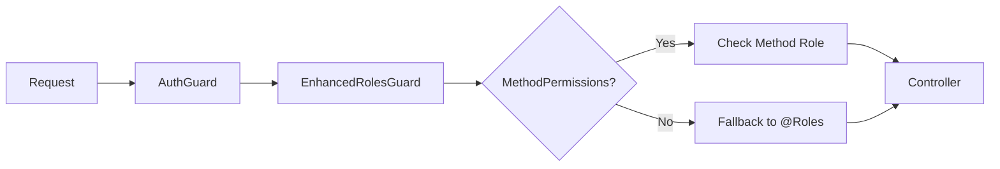

# HTTP Method Permissions Implementation Guide

> **A comprehensive guide to implementing fine-grained HTTP method-based permissions in NestJS applications**

## 📋 Table of Contents

- [Overview](#overview)
- [Quick Start](#quick-start)
- [Architecture](#architecture)
- [Implementation](#implementation)
- [Usage Examples](#usage-examples)
- [Best Practices](#best-practices)
- [API Documentation](#api-documentation)
- [Troubleshooting](#troubleshooting)
- [Migration Guide](#migration-guide)

---

## Overview

This system enables **different permissions for different HTTP methods** (GET, POST, PATCH, DELETE) on a per-controller basis, providing fine-grained access control for REST APIs in NestJS applications.

### 🎯 Key Benefits

- **Method-specific permissions**: Different roles per HTTP method
- **Backward compatibility**: Existing `@Roles` decorators continue working
- **Type safety**: Full TypeScript support with IntelliSense
- **Granular control**: Fine-grained access control per operation
- **Standard NestJS**: Uses standard NestJS patterns and decorators
- **CRUD integration**: Works seamlessly with `@nestjsx/crud`

### 🏗️ Permission Hierarchy

```typescript
@MethodPermissions({
  'GET':    [SYSTEM, QRP, IFDAUSER, IFDAMANAGER, COMPANYOTHER], // Most permissive
  'POST':   [SYSTEM, IFDAMANAGER, QRP],                         // Moderate
  'PATCH':  [SYSTEM, IFDAMANAGER, QRP],                         // Moderate  
  'DELETE': [SYSTEM, IFDAMANAGER]                               // Most restrictive
})
```

---

## Quick Start

### 1. Basic Controller Setup

```typescript
import { Controller } from '@nestjs/common';
import { MethodPermissions } from '../auth/roles.decorator';
import { ROLES } from '../common/interface';

@MethodPermissions({
  'GET': [ROLES.SYSTEM, ROLES.IFDAUSER, ROLES.IFDAMANAGER],
  'POST': [ROLES.SYSTEM, ROLES.IFDAMANAGER],
  'PATCH': [ROLES.SYSTEM, ROLES.IFDAMANAGER],
  'DELETE': [ROLES.SYSTEM]
})
@Controller('example')
export class ExampleController {
  @Get()
  findAll() {
    // Accessible by: SYSTEM, IFDAUSER, IFDAMANAGER
    return this.exampleService.findAll();
  }

  @Post()
  create(@Body() dto: CreateDto) {
    // Accessible by: SYSTEM, IFDAMANAGER
    return this.exampleService.create(dto);
  }

  @Delete(':id')
  remove(@Param('id') id: string) {
    // Accessible by: SYSTEM only
    return this.exampleService.remove(+id);
  }
}
```

### 2. CRUD Controller Setup

```typescript
@Crud({
  model: { type: Entity },
  dto: { create: CreateDto, update: UpdateDto },
  query: {
    limit: 20,
    alwaysPaginate: true,
    join: { relation: { eager: true } }
  }
})
@MethodPermissions({
  'GET': [ROLES.SYSTEM, ROLES.IFDAUSER],
  'POST': [ROLES.SYSTEM],
  'PATCH': [ROLES.SYSTEM],
  'DELETE': [ROLES.SYSTEM]
})
@Controller('example')
export class ExampleController {
  constructor(public service: ExampleService) {}
}
```

---

## Architecture

### System Flow



### Core Components

#### 1. MethodPermissions Decorator
**File**: `src/auth/roles.decorator.ts`

```typescript
export const MethodPermissions = Reflector.createDecorator<{
  [key: string]: ROLES[]
}>();
```

#### 2. EnhancedRolesGuard
**File**: `src/auth/auth.guard.ts`

```typescript
@Injectable()
export class EnhancedRolesGuard implements CanActivate {
  constructor(private reflector: Reflector) {}

  canActivate(context: ExecutionContext): boolean {
    const methodPermissions = this.reflector.getAllAndOverride(MethodPermissions, [
      context.getHandler(),
      context.getClass(),
    ]);

    const request = context.switchToHttp().getRequest();
    const method = request.method;
    const { user } = request;

    // Check method-specific permissions first
    if (methodPermissions && methodPermissions[method]) {
      return methodPermissions[method].includes(user?.role);
    }

    // Fallback to regular @Roles decorator
    const requiredRoles = this.reflector.getAllAndOverride(Roles, [
      context.getHandler(),
      context.getClass(),
    ]);

    if (!requiredRoles) return true;
    return requiredRoles.includes(user?.role);
  }
}
```

#### 3. Updated GlobalGuard
**File**: `src/auth/auth.module.ts`

```typescript
@Injectable()
export class GlobalGuard implements CanActivate {
  constructor(
    private readonly authGuard: AuthGuard,
    private readonly enhancedRolesGuard: EnhancedRolesGuard,
  ) {}

  async canActivate(context: ExecutionContext): Promise<boolean> {
    const authResult = await this.authGuard.canActivate(context);
    if (!authResult) return false;

    return this.enhancedRolesGuard.canActivate(context);
  }
}
```

---

## Implementation

### Available Roles
**File**: `src/common/interface.ts`

```typescript
export enum ROLES {
  SYSTEM = 'system',
  QRP = 'QRP',
  IFDAUSER = 'idfaUser',
  IFDAMANAGER = 'idfaManager',
  COMPANYOTHER = 'companyOther'
}
```

### HTTP Method Mapping

| Operation | HTTP Method | Typical Permission Level | Use Case |
|-----------|-------------|-------------------------|----------|
| List/Read | GET | More permissive (read access) | Data viewing, reports |
| Create | POST | Moderate restrictions | Data entry |
| Update | PATCH | Moderate restrictions | Data modification |
| Delete | DELETE | Highest restrictions | Data removal |

---

## Usage Examples

### 1. Standard REST Controller

```typescript
@MethodPermissions({
  'GET': [ROLES.SYSTEM, ROLES.QRP, ROLES.IFDAUSER, ROLES.IFDAMANAGER, ROLES.COMPANYOTHER],
  'POST': [ROLES.SYSTEM, ROLES.IFDAMANAGER, ROLES.QRP],
  'PATCH': [ROLES.SYSTEM, ROLES.IFDAMANAGER, ROLES.QRP],
  'DELETE': [ROLES.SYSTEM, ROLES.IFDAMANAGER]
})
@ApiTags('companies')
@ApiBearerAuth('bearer-key')
@Controller('companies')
export class CompanyController {
  constructor(private readonly companyService: CompanyService) {}

  @Get()
  @ApiOperation({ summary: 'List all companies' })
  findAll() {
    return this.companyService.findAll();
  }

  @Post()
  @ApiOperation({ summary: 'Create new company' })
  create(@Body() dto: CreateCompanyDto) {
    return this.companyService.create(dto);
  }

  @Patch(':id')
  @ApiOperation({ summary: 'Update company' })
  update(@Param('id') id: string, @Body() dto: UpdateCompanyDto) {
    return this.companyService.update(+id, dto);
  }

  @Delete(':id')
  @ApiOperation({ summary: 'Delete company' })
  remove(@Param('id') id: string) {
    return this.companyService.remove(+id);
  }
}
```

### 2. CRUD with Custom Overrides

```typescript
@Crud({
  model: { type: Request126 },
  dto: { create: CreateRequest126Dto, update: UpdateRequest126Dto },
  query: {
    limit: 20,
    maxLimit: 100,
    alwaysPaginate: true,
    filter: { closedAt: { $isnull: true } },
    join: {
      company: { eager: true },
      line: { eager: true },
      drug: { eager: true }
    },
    sort: [{ field: 'createdAt', order: 'DESC' }]
  }
})
@MethodPermissions({
  'GET': [ROLES.SYSTEM, ROLES.QRP, ROLES.IFDAUSER, ROLES.IFDAMANAGER, ROLES.COMPANYOTHER],
  'POST': [ROLES.SYSTEM, ROLES.IFDAMANAGER, ROLES.QRP],
  'PATCH': [ROLES.SYSTEM, ROLES.IFDAMANAGER, ROLES.QRP],
  'DELETE': [ROLES.SYSTEM, ROLES.IFDAMANAGER]
})
@ApiTags('request126')
@ApiBearerAuth('bearer-key')
@Controller('request126')
export class Request126Controller {
  constructor(public service: Request126Service) {}

  // Custom endpoint with specific permissions
  @Get('closed')
  @Roles([ROLES.SYSTEM]) // Override: Only SYSTEM can view closed requests
  @ApiOperation({ summary: 'Get closed requests (admin only)' })
  getClosedRequests() {
    return this.service.findClosedRequests();
  }
}
```

### 3. Mixed Approach

```typescript
@MethodPermissions({
  'GET': [ROLES.SYSTEM, ROLES.IFDAUSER],
  'POST': [ROLES.SYSTEM]
})
@Controller('mixed')
export class MixedController {
  @Get()
  // Uses MethodPermissions: SYSTEM, IFDAUSER
  findAll() {
    return this.service.findAll();
  }

  @Get('public')
  @Roles([]) // Override: Public access
  getPublicData() {
    return this.service.getPublicData();
  }

  @Post('admin-only')
  @Roles([ROLES.SYSTEM]) // Override: Only SYSTEM
  adminOperation(@Body() data: any) {
    return this.service.adminOperation(data);
  }
}
```

---

## Best Practices

### 1. Permission Design Template

```typescript
@MethodPermissions({
  // Read operations - most permissive
  'GET': [
    ROLES.SYSTEM,           // System admin
    ROLES.IFDAMANAGER,      // IFDA manager  
    ROLES.IFDAUSER,         // IFDA user
    ROLES.QRP,              // Quality responsible person
    ROLES.COMPANYOTHER      // Company users (if applicable)
  ],
  
  // Write operations - moderate restrictions
  'POST': [
    ROLES.SYSTEM,           // System admin
    ROLES.IFDAMANAGER,      // IFDA manager
    ROLES.QRP               // Quality responsible person
  ],
  'PATCH': [
    ROLES.SYSTEM,           // System admin
    ROLES.IFDAMANAGER,      // IFDA manager  
    ROLES.QRP               // Quality responsible person
  ],
  
  // Delete operations - most restrictive
  'DELETE': [
    ROLES.SYSTEM,           // System admin
    ROLES.IFDAMANAGER       // IFDA manager only
  ]
})
```

### 2. Service Structure for CRUD

```typescript
@Injectable()
export class ExampleService {
  constructor(private prisma: DatabaseService) {}
  
  // @nestjsx/crud compatible methods
  async findMany(query?: any) {
    return this.prisma.example.findMany({
      ...query,
      include: { company: true }
    });
  }

  async findOne(id: number) {
    return this.prisma.example.findUnique({
      where: { id },
      include: { company: true }
    });
  }

  async create(data: CreateExampleDto) {
    return this.prisma.example.create({
      data,
      include: { company: true }
    });
  }

  async update(id: number, data: UpdateExampleDto) {
    return this.prisma.example.update({
      where: { id },
      data,
      include: { company: true }
    });
  }

  async remove(id: number) {
    return this.prisma.example.delete({ 
      where: { id },
      include: { company: true }
    });
  }
}
```

### 3. Entity Configuration

```typescript
export class ExampleEntity {
  id: number;
  name: string;
  companyId: number;
  
  // Relations for @nestjsx/crud joins
  company?: Company;
  relatedItems?: RelatedItem[];
}
```

### 4. DTO Best Practices

```typescript
export class CreateExampleDto {
  @ApiProperty({
    description: 'Name of the example',
    example: 'Example Name',
    minLength: 1
  })
  @IsString()
  @MinLength(1)
  name: string;

  @ApiProperty({
    description: 'Company ID',
    example: 1,
    minimum: 1
  })
  @IsInt()
  @Min(1)
  @Transform(({ value }) => parseInt(value))
  companyId: number;
}
```

---

## API Documentation

### Swagger Configuration

**File**: `src/config/swagger.config.ts`

```typescript
import { DocumentBuilder, SwaggerModule } from '@nestjs/swagger';
import { INestApplication } from '@nestjs/common';

export class SwaggerConfig {
  static createDocumentConfig() {
    return new DocumentBuilder()
      .setTitle('GMP Backend API')
      .setDescription('Good Manufacturing Practice (GMP) Backend Service API Documentation')
      .setVersion('1.0.0')
      .addBearerAuth(
        {
          type: 'http',
          scheme: 'bearer',
          bearerFormat: 'JWT',
          name: 'JWT',
          description: 'JWT Authorization using the Bearer scheme',
          in: 'header',
        },
        'bearer-key'
      )
      .addTag('request126', 'Request 126 Management')
      .addTag('company', 'Company Management')
      .build();
  }

  static setup(app: INestApplication, path: string = 'api-docs') {
    const config = this.createDocumentConfig();
    const document = SwaggerModule.createDocument(app, config);
    
    SwaggerModule.setup(path, app, document, {
      swaggerOptions: {
        persistAuthorization: true,
        displayOperationId: false,
        filter: true,
        tryItOutEnabled: true,
      },
      customSiteTitle: 'GMP Backend API Documentation',
    });
    
    return document;
  }
}
```

### Controller Documentation

```typescript
@ApiTags('request126')
@ApiBearerAuth('bearer-key')
@Controller('request126')
export class Request126Controller {
  @Get()
  @ApiOperation({ 
    summary: 'List all requests',
    description: 'Get paginated list of non-closed requests with filtering capabilities'
  })
  @ApiResponse({ status: 200, description: 'Requests retrieved successfully' })
  @ApiResponse({ status: 401, description: 'Unauthorized' })
  @ApiResponse({ status: 403, description: 'Forbidden' })
  findAll() {
    return this.service.findAll();
  }
}
```

### Documentation Features

- **JWT Authentication**: Built-in Bearer token support
- **Interactive Testing**: Try It Out functionality
- **Persistent Auth**: Authentication persists across page refreshes
- **Advanced Filtering**: Search and filter in UI
- **Permission Display**: Clear indication of required permissions

Access documentation at: `http://localhost:8000/api-docs`

---

## Troubleshooting

### Common Issues

#### ❌ Access Denied for Valid Users

**Problem**: Method permissions don't match actual HTTP methods

```typescript
// Wrong: @nestjsx/crud uses PATCH, not PUT
@MethodPermissions({
  'PUT': [ROLES.SYSTEM]
})

// Correct:
@MethodPermissions({
  'PATCH': [ROLES.SYSTEM]
})
```

#### ❌ Invalid CRUD Configuration

**Problem**: Incorrect @nestjsx/crud filter syntax

```typescript
// Wrong:
@Crud({
  query: {
    filter: { closedAt: { $isNull: true } }, // Invalid syntax
  }
})

// Correct:
@Crud({
  query: {
    filter: { closedAt: { $isnull: true } }, // Correct syntax
  }
})
```

#### ❌ Missing Entity Relations

**Problem**: Entity missing relation properties

```typescript
// Wrong:
export class Example {
  id: number;
  companyId: number;
}

// Correct:
export class Example {
  id: number;
  companyId: number;
  company?: Company; // Add relation property
}
```

### Debugging Steps

1. **Check Route Generation**
   ```bash
   npm run start:dev
   # Check console logs for generated routes
   ```

2. **Test with curl**
   ```bash
   # Test GET endpoint
   curl -H "Authorization: Bearer <token>" \
        http://localhost:8000/api/request126

   # Test POST endpoint
   curl -X POST \
        -H "Authorization: Bearer <token>" \
        -H "Content-Type: application/json" \
        -d '{"type":"test"}' \
        http://localhost:8000/api/request126
   ```

3. **Add Guard Logging**
   ```typescript
   canActivate(context: ExecutionContext): boolean {
     console.log('Method permissions:', methodPermissions);
     console.log('HTTP method:', request.method);
     console.log('User role:', request.user?.role);
     // ... rest of method
   }
   ```

---

## Migration Guide

### Step 1: Identify Controllers

Find controllers needing different permissions per operation:

```bash
grep -r "@Roles" src/ --include="*.controller.ts"
```

### Step 2: Analyze Current Permissions

Document existing permission patterns:

```typescript
// Before
class ExampleController {
  @Roles([ROLES.SYSTEM, ROLES.IFDAUSER])
  @Get()
  findAll() {}

  @Roles([ROLES.SYSTEM])
  @Post()
  create() {}
}
```

### Step 3: Convert to Method Permissions

```typescript
// After
@MethodPermissions({
  'GET': [ROLES.SYSTEM, ROLES.IFDAUSER],
  'POST': [ROLES.SYSTEM]
})
class ExampleController {
  @Get()
  findAll() {} // No decorator needed

  @Post()
  create() {} // No decorator needed
}
```

### Step 4: Test Migration

1. **Unit Tests**: Verify guard behavior
2. **Integration Tests**: Test actual endpoints  
3. **Manual Testing**: Use different user roles

---

## Module Creation Checklist

When creating a new module with HTTP method permissions:

### ✅ 1. Define Entity
```typescript
export class Example {
  id: number;
  name: string;
  companyId: number;
  company?: Company; // For joins
}
```

### ✅ 2. Create DTOs
```typescript
export class CreateExampleDto {
  @IsString() @MinLength(1)
  name: string;
  
  @IsInt() @Min(1)
  companyId: number;
}
```

### ✅ 3. Implement Service
```typescript
@Injectable()
export class ExampleService {
  // Implement: findMany, findOne, create, update, remove
}
```

### ✅ 4. Create Controller
```typescript
@MethodPermissions({
  'GET': [ROLES.SYSTEM, ROLES.IFDAUSER],
  'POST': [ROLES.SYSTEM],
  'PATCH': [ROLES.SYSTEM],
  'DELETE': [ROLES.SYSTEM]
})
@Controller('example')
export class ExampleController {
  constructor(public service: ExampleService) {}
}
```

### ✅ 5. Configure Module
```typescript
@Module({
  controllers: [ExampleController],
  providers: [ExampleService],
  exports: [ExampleService]
})
export class ExampleModule {}
```

---

## Conclusion

The HTTP Method Permissions system provides:

- **🎯 Fine-grained access control** per HTTP method
- **🔄 Backward compatibility** with existing `@Roles` decorators
- **🛡️ Type safety** with full TypeScript support
- **📈 Scalable architecture** that grows with your application
- **📚 Comprehensive documentation** with Swagger integration

This approach ensures clear, auditable permission boundaries while maintaining NestJS best practices and developer experience.

**For support or improvements**, refer to:
- Implementation: `src/auth/`
- Working example: `src/request126/`
- API documentation: `http://localhost:8000/api-docs`