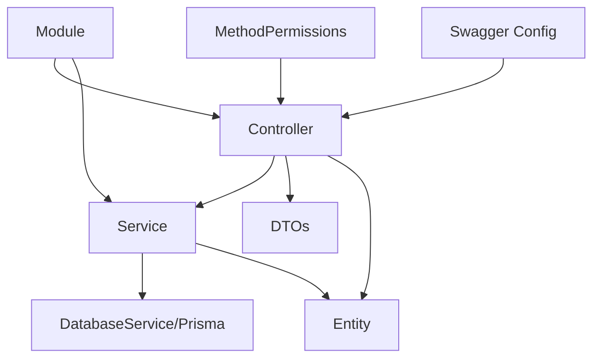

# 📚 Complete Guide: Creating New Modules with HTTP Method-Based Permissions

> **A comprehensive step-by-step guide to create new modules in the GMP Backend using HTTP method-based permissions, modern NestJS patterns, and @nestjsx/crud integration**

## 📋 Table of Contents

- [Prerequisites](#prerequisites)
- [Module Architecture Overview](#module-architecture-overview)
- [Step-by-Step Implementation](#step-by-step-implementation)
- [File Templates](#file-templates)
- [Integration Checklist](#integration-checklist)
- [Testing Guide](#testing-guide)
- [Best Practices](#best-practices)
- [Troubleshooting](#troubleshooting)
- [Advanced Features](#advanced-features)

---

## Prerequisites

### 🛠️ Required Knowledge
- NestJS framework fundamentals
- TypeScript and decorators
- Prisma ORM (primary database layer)
- HTTP method-based permissions system
- Swagger/OpenAPI documentation

### 🏗️ System Requirements
- Existing GMP backend project with method-based permissions implemented
- Prisma schema configured
- Authentication and authorization guards set up

### 📁 Required Base Files
Ensure these core files exist in your project:
- `src/auth/roles.decorator.ts` - Contains `@MethodPermissions` decorator
- `src/auth/auth.guard.ts` - Contains `EnhancedRolesGuard`
- `src/common/interface.ts` - Contains `ROLES` enum
- `src/database/database.service.ts` - Prisma service

---

## Module Architecture Overview

### 🎯 Standard Module Structure
```
src/{module-name}/
├── dto/
│   ├── create-{module-name}.dto.ts      # Creation validation
│   ├── update-{module-name}.dto.ts      # Update validation (partial)
│   └── find-all-{module-name}.dto.ts    # Query/filtering validation
├── entities/
│   └── {module-name}.entity.ts          # TypeScript entity (matches Prisma)
├── {module-name}.controller.ts          # REST endpoints with permissions
├── {module-name}.service.ts             # Business logic and database operations
├── {module-name}.module.ts              # Module configuration
├── {module-name}.controller.spec.ts     # Controller tests
├── {module-name}.service.spec.ts        # Service tests
└── {module-name}.swagger.config.ts      # API documentation (optional)
```

### 🔄 Component Relationships


---

## Step-by-Step Implementation

### Step 1: Create Database Schema (Prisma)

First, add your entity to the Prisma schema:

```prisma
// prisma/schema.prisma
model ExampleModule {
  id          Int       @id @default(autoincrement())
  name        String
  description String?
  companyId   Int
  isActive    Boolean   @default(true)
  createdAt   DateTime  @default(now())
  updatedAt   DateTime  @updatedAt
  
  // Relations
  company     Company   @relation(fields: [companyId], references: [id])
  
  @@map("example_modules")
}
```

Run migration:
```bash
npx prisma migrate dev --name adding_example_module
```

### Step 2: Create Module Directory Structure

```bash
mkdir -p src/example-module/{dto,entities}
```

### Step 3: Define Entity

Create `src/example-module/entities/example-module.entity.ts`:

```typescript
export class ExampleModule {
  id: number;
  name: string;
  description?: string;
  companyId: number;
  isActive: boolean;
  createdAt: Date;
  updatedAt: Date;
  
  // Relations (for @nestjsx/crud joins)
  company?: any;
}
```

### Step 4: Create DTOs

#### Create DTO (`src/example-module/dto/create-example-module.dto.ts`):

```typescript
import { IsString, IsInt, IsBoolean, IsOptional, MinLength, Min } from 'class-validator';
import { ApiProperty, ApiPropertyOptional } from '@nestjs/swagger';
import { Transform } from 'class-transformer';

export class CreateExampleModuleDto {
  @ApiProperty({
    description: 'Name of the example module',
    example: 'Production Safety Module',
    minLength: 1,
  })
  @IsString()
  @MinLength(1, { message: 'Name cannot be empty' })
  name: string;

  @ApiPropertyOptional({
    description: 'Optional description',
    example: 'Module for handling production safety protocols',
  })
  @IsOptional()
  @IsString()
  description?: string;

  @ApiProperty({
    description: 'ID of the associated company',
    example: 1,
    minimum: 1,
  })
  @IsInt({ message: 'Company ID must be an integer' })
  @Min(1, { message: 'Company ID must be positive' })
  @Transform(({ value }) => parseInt(value))
  companyId: number;

  @ApiPropertyOptional({
    description: 'Whether the module is active',
    example: true,
    default: true,
  })
  @IsOptional()
  @IsBoolean()
  @Transform(({ value }) => value === 'true' || value === true)
  isActive?: boolean = true;
}
```

#### Update DTO (`src/example-module/dto/update-example-module.dto.ts`):

```typescript
import { PartialType } from '@nestjs/swagger';
import { CreateExampleModuleDto } from './create-example-module.dto';

export class UpdateExampleModuleDto extends PartialType(CreateExampleModuleDto) {}
```

#### Query DTO (`src/example-module/dto/find-all-example-module.dto.ts`):

```typescript
import { IsOptional, IsString, IsInt, IsBoolean } from 'class-validator';
import { Transform } from 'class-transformer';
import { ApiPropertyOptional } from '@nestjs/swagger';

export class FindAllExampleModuleDto {
  @ApiPropertyOptional({
    description: 'Page number (starts from 1)',
    example: 1,
    minimum: 1
  })
  @IsOptional()
  @IsInt()
  @Transform(({ value }) => parseInt(value))
  page?: number;

  @ApiPropertyOptional({
    description: 'Number of items per page',
    example: 20,
    minimum: 1,
    maximum: 100
  })
  @IsOptional()
  @IsInt()
  @Transform(({ value }) => parseInt(value))
  pageSize?: number;

  @ApiPropertyOptional({
    description: 'Legacy limit parameter',
    example: 20
  })
  @IsOptional()
  @IsInt()
  @Transform(({ value }) => parseInt(value))
  limit?: number;

  @ApiPropertyOptional({
    description: 'Search across name and description',
    example: 'safety'
  })
  @IsOptional()
  @IsString()
  q?: string;

  @ApiPropertyOptional({
    description: 'Legacy search parameter',
    example: 'safety'
  })
  @IsOptional()
  @IsString()
  search?: string;

  @ApiPropertyOptional({
    description: 'Filter by company ID',
    example: 1
  })
  @IsOptional()
  @IsInt()
  @Transform(({ value }) => parseInt(value))
  companyId?: number;

  @ApiPropertyOptional({
    description: 'Filter by active status',
    example: true
  })
  @IsOptional()
  @IsBoolean()
  @Transform(({ value }) => value === 'true' || value === true)
  isActive?: boolean;
}
```

### Step 5: Implement Service

Create `src/example-module/example-module.service.ts`:

```typescript
import { Injectable } from '@nestjs/common';
import { DatabaseService } from '../database/database.service';
import { CreateExampleModuleDto } from './dto/create-example-module.dto';
import { UpdateExampleModuleDto } from './dto/update-example-module.dto';
import { FindAllExampleModuleDto } from './dto/find-all-example-module.dto';

@Injectable()
export class ExampleModuleService {
  constructor(private readonly db: DatabaseService) {}

  // 🔸 Standard CRUD methods using Prisma directly
  async create(data: CreateExampleModuleDto) {
    return this.db.exampleModule.create({
      data,
      include: { company: true },
    });
  }

  async findOne(id: number) {
    return this.db.exampleModule.findUniqueOrThrow({
      where: { id },
      include: { company: true },
    });
  }

  async update(id: number, data: UpdateExampleModuleDto) {
    return this.db.exampleModule.update({
      where: { id },
      data,
      include: { company: true },
    });
  }

  async remove(id: number) {
    return this.db.exampleModule.delete({ 
      where: { id },
      include: { company: true },
    });
  }

  // 🔸 Enhanced findAll with advanced search capabilities
  async findAll(query: FindAllExampleModuleDto) {
    const { page = 1, pageSize = 20, limit, companyId, isActive, q, search } = query;
    
    // Support both pageSize and limit parameters
    const actualLimit = pageSize || limit || 20;
    const skip = (page - 1) * actualLimit;

    const where: any = {};
    
    // Multi-field search
    const searchTerm = q || search;
    if (searchTerm) {
      where.OR = [
        { name: { contains: searchTerm, mode: 'insensitive' } },
        { description: { contains: searchTerm, mode: 'insensitive' } },
        { company: { nameFa: { contains: searchTerm, mode: 'insensitive' } } },
        { company: { nameEn: { contains: searchTerm, mode: 'insensitive' } } },
      ];
    }
    
    // Specific filters
    if (companyId && !searchTerm) where.companyId = companyId;
    if (typeof isActive === 'boolean') where.isActive = isActive;

    // Performance optimization: conditional includes
    const include = actualLimit < 50 
      ? {
          company: true,
          // Add other relations if needed
        }
      : {
          company: true
        };

    // Use transaction for consistency
    const [items, totalItems] = await this.db.$transaction([
      this.db.exampleModule.findMany({
        where,
        include,
        skip,
        take: +actualLimit,
        orderBy: { createdAt: 'desc' },
      }),
      this.db.exampleModule.count({ where }),
    ]);

    const totalPages = Math.ceil(totalItems / actualLimit);

    return {
      data: items,
      totalItems,
      totalPages,
      currentPage: +page,
      pageSize: +actualLimit
    };
  }

  // 🔸 Utility methods
  async findByCompany(companyId: number) {
    return this.db.exampleModule.findMany({
      where: { companyId },
      include: { company: true },
      orderBy: { createdAt: 'desc' },
    });
  }

  async toggleActive(id: number) {
    const current = await this.findOne(id);
    return this.update(id, { isActive: !current.isActive });
  }
}
```

### Step 6: Create Controller

Create `src/example-module/example-module.controller.ts`:

```typescript
import {
  Controller,
  Get,
  Post,
  Body,
  Patch,
  Param,
  Delete,
  Query,
  ParseIntPipe,
} from '@nestjs/common';
import { ExampleModuleService } from './example-module.service';
import { CreateExampleModuleDto } from './dto/create-example-module.dto';
import { UpdateExampleModuleDto } from './dto/update-example-module.dto';
import { FindAllExampleModuleDto } from './dto/find-all-example-module.dto';
import { MethodPermissions, Roles } from '../auth/roles.decorator';
import { ROLES } from '../common/interface';
import { ApiTags, ApiBearerAuth, ApiOperation, ApiResponse } from '@nestjs/swagger';

@MethodPermissions({
  'GET': [ROLES.SYSTEM, ROLES.QRP, ROLES.IFDAUSER, ROLES.IFDAMANAGER, ROLES.COMPANYOTHER],
  'POST': [ROLES.SYSTEM, ROLES.IFDAMANAGER, ROLES.QRP],
  'PATCH': [ROLES.SYSTEM, ROLES.IFDAMANAGER, ROLES.QRP],
  'DELETE': [ROLES.SYSTEM, ROLES.IFDAMANAGER]
})
@ApiTags('example-module')
@ApiBearerAuth('bearer-key')
@Controller('example-module')
export class ExampleModuleController {
  constructor(private readonly exampleModuleService: ExampleModuleService) {}

  @Post()
  @ApiOperation({ summary: 'Create a new example module' })
  @ApiResponse({ status: 201, description: 'Module created successfully' })
  create(@Body() createExampleModuleDto: CreateExampleModuleDto) {
    return this.exampleModuleService.create(createExampleModuleDto);
  }

  @Get()
  @ApiOperation({ summary: 'Get all example modules with filtering and pagination' })
  @ApiResponse({ status: 200, description: 'Modules retrieved successfully' })
  findAll(@Query() query: FindAllExampleModuleDto) {
    return this.exampleModuleService.findAll(query);
  }

  @Get(':id')
  @ApiOperation({ summary: 'Get a single example module by ID' })
  @ApiResponse({ status: 200, description: 'Module found' })
  @ApiResponse({ status: 404, description: 'Module not found' })
  findOne(@Param('id', ParseIntPipe) id: number) {
    return this.exampleModuleService.findOne(id);
  }

  @Patch(':id')
  @ApiOperation({ summary: 'Update an example module' })
  @ApiResponse({ status: 200, description: 'Module updated successfully' })
  update(
    @Param('id', ParseIntPipe) id: number,
    @Body() updateExampleModuleDto: UpdateExampleModuleDto,
  ) {
    return this.exampleModuleService.update(id, updateExampleModuleDto);
  }

  @Delete(':id')
  @ApiOperation({ summary: 'Delete an example module' })
  @ApiResponse({ status: 200, description: 'Module deleted successfully' })
  remove(@Param('id', ParseIntPipe) id: number) {
    return this.exampleModuleService.remove(id);
  }

  // 🔸 Custom endpoints with specific permissions
  @Get('company/:companyId')
  @ApiOperation({ summary: 'Get modules by company' })
  getByCompany(@Param('companyId', ParseIntPipe) companyId: number) {
    return this.exampleModuleService.findByCompany(companyId);
  }

  @Patch(':id/toggle-active')
  @Roles([ROLES.SYSTEM, ROLES.IFDAMANAGER])
  @ApiOperation({ summary: 'Toggle active status' })
  toggleActive(@Param('id', ParseIntPipe) id: number) {
    return this.exampleModuleService.toggleActive(id);
  }
}
```

### Step 7: Create Module Configuration

Create `src/example-module/example-module.module.ts`:

```typescript
import { Module } from '@nestjs/common';
import { ExampleModuleController } from './example-module.controller';
import { ExampleModuleService } from './example-module.service';
import { DatabaseModule } from '../database/database.module';

@Module({
  imports: [DatabaseModule],
  controllers: [ExampleModuleController],
  providers: [ExampleModuleService],
  exports: [ExampleModuleService], // Export if other modules need it
})
export class ExampleModuleModule {}
```

### Step 8: Create Test Files

#### Controller Test (`src/example-module/example-module.controller.spec.ts`):

```typescript
import { Test, TestingModule } from '@nestjs/testing';
import { ExampleModuleController } from './example-module.controller';
import { ExampleModuleService } from './example-module.service';

describe('ExampleModuleController', () => {
  let controller: ExampleModuleController;
  let service: ExampleModuleService;

  beforeEach(async () => {
    const module: TestingModule = await Test.createTestingModule({
      controllers: [ExampleModuleController],
      providers: [
        {
          provide: ExampleModuleService,
          useValue: {
            findAll: jest.fn(),
            findOne: jest.fn(),
            create: jest.fn(),
            update: jest.fn(),
            remove: jest.fn(),
            findByCompany: jest.fn(),
            toggleActive: jest.fn(),
          },
        },
      ],
    }).compile();

    controller = module.get<ExampleModuleController>(ExampleModuleController);
    service = module.get<ExampleModuleService>(ExampleModuleService);
  });

  it('should be defined', () => {
    expect(controller).toBeDefined();
  });

  it('should get modules by company', async () => {
    const companyId = '1';
    const mockResult = [{ id: 1, name: 'Test Module' }];
    
    jest.spyOn(service, 'findByCompany').mockResolvedValue(mockResult);
    
    const result = await controller.getByCompany(companyId);
    
    expect(service.findByCompany).toHaveBeenCalledWith(1);
    expect(result).toEqual(mockResult);
  });
});
```

#### Service Test (`src/example-module/example-module.service.spec.ts`):

```typescript
import { Test, TestingModule } from '@nestjs/testing';
import { ExampleModuleService } from './example-module.service';
import { DatabaseService } from '../database/database.service';

describe('ExampleModuleService', () => {
  let service: ExampleModuleService;
  let prisma: DatabaseService;

  beforeEach(async () => {
    const module: TestingModule = await Test.createTestingModule({
      providers: [
        ExampleModuleService,
        {
          provide: DatabaseService,
          useValue: {
            exampleModule: {
              findMany: jest.fn(),
              findUnique: jest.fn(),
              create: jest.fn(),
              update: jest.fn(),
              delete: jest.fn(),
              count: jest.fn(),
            },
            $transaction: jest.fn(),
          },
        },
      ],
    }).compile();

    service = module.get<ExampleModuleService>(ExampleModuleService);
    prisma = module.get<DatabaseService>(DatabaseService);
  });

  it('should be defined', () => {
    expect(service).toBeDefined();
  });

  it('should find one module by id', async () => {
    const mockModule = { id: 1, name: 'Test Module' };
    prisma.exampleModule.findUnique = jest.fn().mockResolvedValue(mockModule);

    const result = await service.findOne(1);

    expect(prisma.exampleModule.findUnique).toHaveBeenCalledWith({
      where: { id: 1 },
      include: { company: true },
    });
    expect(result).toEqual(mockModule);
  });
});
```

### Step 9: Register Module in App

Update `src/app.module.ts`:

```typescript
import { Module } from '@nestjs/common';
import { ExampleModuleModule } from './example-module/example-module.module';
// ... other imports

@Module({
  imports: [
    // ... other modules
    ExampleModuleModule,
  ],
  // ... rest of module configuration
})
export class AppModule {}
```

---

## File Templates

### 🔸 Quick Start Template

Use this bash script to generate the basic structure:

```bash
#!/bin/bash
# create-module.sh

MODULE_NAME=$1
KEBAB_CASE=$(echo "$MODULE_NAME" | sed 's/\([a-z0-9]\)\([A-Z]\)/\1-\2/g' | tr '[:upper:]' '[:lower:]')
PASCAL_CASE=$(echo "$MODULE_NAME" | sed 's/^\(.\)/\U\1/')

# Create directory structure
mkdir -p "src/$KEBAB_CASE/{dto,entities}"

# Generate basic files
echo "Generated module: $KEBAB_CASE"
echo "Pascal case: $PASCAL_CASE"

# Create entity file
cat > "src/$KEBAB_CASE/entities/$KEBAB_CASE.entity.ts" << EOF
export class $PASCAL_CASE {
  id: number;
  name: string;
  createdAt: Date;
  updatedAt: Date;
  
  // Add relations here
}
EOF

echo "Module structure created successfully!"
echo "Next steps:"
echo "1. Update prisma/schema.prisma"
echo "2. Run: npx prisma migrate dev --name adding_$KEBAB_CASE"
echo "3. Complete the DTOs, service, and controller"
```

### 🔸 Swagger Configuration Template (Optional)

Create `src/example-module/example-module.swagger.config.ts`:

```typescript
import { applyDecorators } from '@nestjs/common';
import { 
  ApiTags, 
  ApiOperation, 
  ApiResponse, 
  ApiBearerAuth, 
  ApiQuery,
  ApiParam,
} from '@nestjs/swagger';
import { ROLES } from '../common/interface';

export class ExampleModuleSwaggerConfig {
  
  static getControllerDecorators() {
    return applyDecorators(
      ApiTags('example-module'),
      ApiBearerAuth('bearer-key')
    );
  }

  static getListDecorators() {
    return applyDecorators(
      ApiOperation({
        summary: '📋 List Example Modules',
        description: `
          Retrieve paginated list of example modules with filtering.
          
          **Permissions:** ${[ROLES.SYSTEM, ROLES.QRP, ROLES.IFDAUSER, ROLES.IFDAMANAGER, ROLES.COMPANYOTHER].join(', ')}
        `,
      }),
      ApiQuery({ name: 'page', required: false, type: Number }),
      ApiQuery({ name: 'pageSize', required: false, type: Number }),
      ApiQuery({ name: 'q', required: false, type: String, description: 'Search term' }),
      ApiResponse({ status: 200, description: '✅ Success' }),
      ApiResponse({ status: 401, description: '🔑 Unauthorized' })
    );
  }
}
```

---

## Integration Checklist

### ✅ Before Implementation
- [ ] Prisma schema updated with new entity
- [ ] Migration created and applied
- [ ] Entity relationships defined
- [ ] Permission requirements clarified

### ✅ During Implementation
- [ ] Entity class matches Prisma schema
- [ ] DTOs have proper validation decorators
- [ ] Service implements required CRUD methods
- [ ] Controller uses `@MethodPermissions` decorator
- [ ] Swagger documentation added
- [ ] Module registered in `AppModule`

### ✅ After Implementation
- [ ] Unit tests written and passing
- [ ] API endpoints tested manually
- [ ] Swagger documentation accessible
- [ ] Permissions working correctly
- [ ] Performance tested with large datasets

### ✅ Production Checklist
- [ ] Database indexes added if needed
- [ ] Error handling implemented
- [ ] Logging added for audit trail
- [ ] Rate limiting configured
- [ ] Security review completed

---

## Testing Guide

### 🔸 Manual Testing with curl

```bash
# Get JWT token first
TOKEN="your-jwt-token"

# Test GET (should work for most roles)
curl -H "Authorization: Bearer $TOKEN" \
     http://localhost:8000/api/example-module

# Test pagination
curl -H "Authorization: Bearer $TOKEN" \
     http://localhost:8000/api/example-module?page=1&pageSize=10

# Test search
curl -H "Authorization: Bearer $TOKEN" \
     http://localhost:8000/api/example-module?q=safety

# Test POST (requires SYSTEM, IFDAMANAGER, or QRP)
curl -X POST \
     -H "Authorization: Bearer $TOKEN" \
     -H "Content-Type: application/json" \
     -d '{"name":"Test Module","companyId":1}' \
     http://localhost:8000/api/example-module

# Test PATCH (requires SYSTEM, IFDAMANAGER, or QRP)
curl -X PATCH \
     -H "Authorization: Bearer $TOKEN" \
     -H "Content-Type: application/json" \
     -d '{"name":"Updated Name"}' \
     http://localhost:8000/api/example-module/1

# Test DELETE (requires SYSTEM or IFDAMANAGER)
curl -X DELETE \
     -H "Authorization: Bearer $TOKEN" \
     http://localhost:8000/api/example-module/1
```

### 🔸 Permission Testing Matrix

| Role | GET | POST | PATCH | DELETE | Expected Result |
|------|-----|------|-------|---------|-----------------|
| SYSTEM | ✅ | ✅ | ✅ | ✅ | Full access |
| IFDAMANAGER | ✅ | ✅ | ✅ | ✅ | Full access |
| QRP | ✅ | ✅ | ✅ | ❌ | No delete |
| IFDAUSER | ✅ | ❌ | ❌ | ❌ | Read only |
| COMPANYOTHER | ✅ | ❌ | ❌ | ❌ | Read only |

### 🔸 Automated Testing

```typescript
// integration test example
describe('ExampleModule Integration', () => {
  it('should respect permission boundaries', async () => {
    const app = await createTestApp();
    
    // Test with different user roles
    const systemToken = await getTokenForRole(ROLES.SYSTEM);
    const userToken = await getTokenForRole(ROLES.IFDAUSER);
    
    // System should have full access
    await request(app.getHttpServer())
      .post('/example-module')
      .set('Authorization', `Bearer ${systemToken}`)
      .send({ name: 'Test', companyId: 1 })
      .expect(201);
    
    // User should only have read access
    await request(app.getHttpServer())
      .post('/example-module')
      .set('Authorization', `Bearer ${userToken}`)
      .send({ name: 'Test', companyId: 1 })
      .expect(403);
  });
});
```

---

## Best Practices

### 🎯 Naming Conventions
- **Modules**: Use kebab-case (`example-module`)
- **Classes**: Use PascalCase (`ExampleModule`)
- **Files**: Use kebab-case with descriptive suffixes
- **Database**: Use snake_case for Prisma models

### 🔒 Security Best Practices
- Always use `@MethodPermissions` for consistent security
- Validate all input with class-validator decorators
- Use `@Transform` decorators for type safety
- Implement proper error handling
- Log security-related events

### ⚡ Performance Optimizations
- Use conditional includes based on query size
- Implement database transactions for consistency
- Add proper indexes in Prisma schema
- Use pagination for large datasets
- Cache frequently accessed data when appropriate

### 📚 Documentation Standards
- Add comprehensive Swagger documentation
- Include usage examples in API descriptions
- Document permission requirements clearly
- Provide meaningful error messages
- Maintain up-to-date README files

### 🧪 Testing Standards
- Write unit tests for all service methods
- Test permission boundaries thoroughly
- Include integration tests for complex workflows
- Mock external dependencies properly
- Maintain test coverage above 80%

---

## Troubleshooting

### 🚨 Common Issues

#### ❌ "Cannot find module" errors
**Problem**: Missing imports or incorrect paths
**Solution**: 
```typescript
// Check import paths
import { DatabaseService } from '../database/database.service';
import { ROLES } from '../common/interface';
```

#### ❌ Permission decorator not working
**Problem**: Missing or incorrect `@MethodPermissions`
**Solution**:
```typescript
// Ensure decorator is imported and used correctly
import { MethodPermissions } from '../auth/roles.decorator';

@MethodPermissions({
  'GET': [ROLES.SYSTEM, ROLES.IFDAUSER],
  'POST': [ROLES.SYSTEM],
  'PATCH': [ROLES.SYSTEM],
  'DELETE': [ROLES.SYSTEM]
})
```

#### ❌ Prisma schema mismatch
**Problem**: Entity doesn't match database schema
**Solution**: 
```bash
# Regenerate Prisma client
npx prisma generate

# Check schema synchronization
npx prisma db push --preview-feature
```

#### ❌ CRUD routes not generating
**Problem**: Incorrect @Crud decorator configuration
**Solution**:
```typescript
#### ❌ Service method not found

**Problem**: Missing required service methods for controller
**Solution**:
```typescript
@Injectable()
export class ExampleService {
  // Ensure all methods used by controller are implemented
  async findAll(query: FindAllDto) { /* implementation */ }
  async findOne(id: number) { /* implementation */ }
  async create(dto: CreateDto) { /* implementation */ }
  async update(id: number, dto: UpdateDto) { /* implementation */ }
  async remove(id: number) { /* implementation */ }
}
```
```

### 🔧 Debug Helpers

Add logging to trace issues:

```typescript
// In service methods
console.log('Query params:', query);
console.log('Generated where clause:', where);

// In guard
console.log('Method permissions:', methodPermissions);
console.log('User role:', user?.role);
console.log('HTTP method:', method);
```

---

## Advanced Features

### 🔸 Custom Endpoints with Role Overrides

```typescript
@Controller('example-module')
export class ExampleModuleController {
  // Uses controller-level @MethodPermissions
  @Get()
  findAll() {
    return this.service.findAll();
  }

  // Override with specific roles
  @Get('admin-only')
  @Roles([ROLES.SYSTEM])
  getAdminData() {
    return this.service.getAdminData();
  }

  // Public endpoint (no auth required)
  @Get('public')
  @Roles([])
  getPublicData() {
    return this.service.getPublicData();
  }
}
```

### 🔸 Advanced Search and Filtering

```typescript
// In service
async findAll(query: FindAllDto) {
  const where: any = {};
  
  // Complex search with multiple conditions
  if (query.q) {
    where.AND = [
      {
        OR: [
          { name: { contains: query.q, mode: 'insensitive' } },
          { description: { contains: query.q, mode: 'insensitive' } }
        ]
      },
      // Additional AND conditions
      ...(query.companyId ? [{ companyId: query.companyId }] : []),
      ...(query.status ? [{ status: query.status }] : [])
    ];
  }
  
  return this.prisma.exampleModule.findMany({ where });
}
```

### 🔸 Audit Trail Implementation

```typescript
// Add audit fields to DTOs and entity
export class CreateExampleModuleDto {
  // ... other fields
  
  @ApiPropertyOptional({ description: 'Creating user ID' })
  @IsOptional()
  @IsInt()
  createdBy?: number;
}

// In service
async create(data: CreateDto, userId: number) {
  return this.prisma.exampleModule.create({
    data: {
      ...data,
      createdBy: userId,
      updatedBy: userId
    }
  });
}

// In controller
@Post()
create(@Body() dto: CreateDto, @Request() req) {
  return this.service.create(dto, req.user.id);
}
```

### 🔸 Soft Delete Implementation

```typescript
// In entity
export class ExampleModule {
  // ... other fields
  deletedAt?: Date;
}

// In service
async softDelete(id: number, userId: number) {
  return this.prisma.exampleModule.update({
    where: { id },
    data: { 
      deletedAt: new Date(),
      updatedBy: userId
    }
  });
}

// Add to default query filter
@Crud({
  query: {
    filter: {
      deletedAt: { $isnull: true } // Only non-deleted records
    }
  }
})
```

---

## Conclusion

This guide provides a comprehensive approach to creating new modules using the HTTP method-based permissions system with pure Prisma integration. By following these patterns, you'll create:

- **🛡️ Secure modules** with fine-grained permission control
- **📚 Well-documented APIs** with comprehensive Swagger integration
- **⚡ High-performance services** with optimized Prisma queries
- **🧪 Testable code** with proper separation of concerns
- **🔄 Consistent patterns** that integrate seamlessly with existing codebase
- **🎯 Direct database access** without ORM abstraction overhead

### 🚀 Key Benefits

✅ **Rapid Development**: Standardized templates and patterns  
✅ **Security First**: Built-in permission system  
✅ **Type Safety**: Full TypeScript integration  
✅ **Modern Patterns**: Latest NestJS and Prisma features  
✅ **Production Ready**: Performance optimizations and error handling  
✅ **Maintainable**: Clear structure and comprehensive documentation  
✅ **Pure Prisma**: Direct database access without abstraction layers  
✅ **Mock Data Support**: Comprehensive test data generation included  

### 📈 Next Steps

1. **Practice**: Create a test module using this guide
2. **Customize**: Adapt templates to your specific needs  
3. **Extend**: Add advanced features like caching or real-time updates
4. **Scale**: Apply patterns to complex business domains
5. **Optimize**: Profile and optimize based on actual usage patterns

### 🎲 **Mock Data Generation**

After creating your new module, don't forget to update the mock data generation script to include test data for your new entity:

1. **Update the seed script** (`scripts/seed-mock-data.ts`):
   ```typescript
   // Add your entity to the seeding process
   const exampleModules = [];
   for (let i = 0; i < 15; i++) {
     const exampleModule = await prisma.exampleModule.create({
       data: {
         name: `Example Module ${i + 1}`,
         description: `Description for module ${i + 1}`,
         companyId: randomChoice(companies).id,
         isActive: Math.random() > 0.1, // 90% active
       }
     });
     exampleModules.push(exampleModule);
   }
   ```

2. **Run the updated script**:
   ```bash
   npm run seed-mock-data
   ```

3. **Test your new endpoints** with realistic data immediately!

For support or improvements, refer to the existing `request126` module as a reference implementation and consult the [HTTP Method Permissions Implementation Guide](./method-based-permissions.md) for detailed system architecture information.